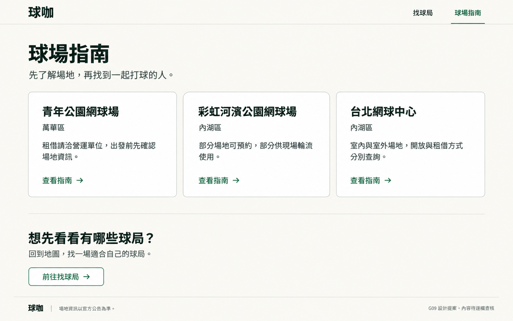
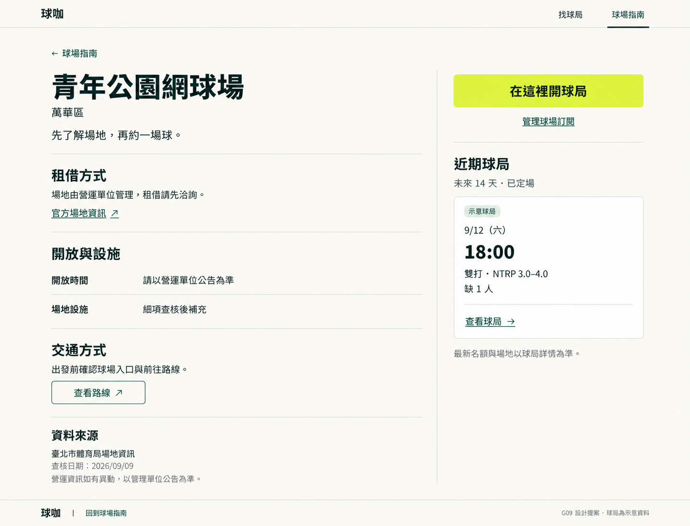
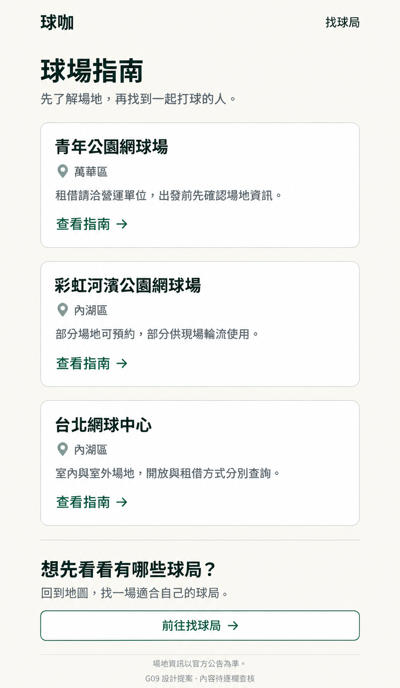
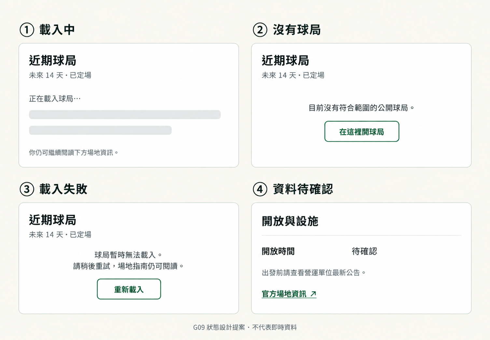

# G09 球場指南視覺提案 v1

日期：2026-09-09。狀態：**使用者已以「ok,同意」核可；已實作，進入瀏覽器 QA。部署狀態見 progress.md。**

使用者的「ok」承接先製作指南索引與單一指南之手機／桌面視覺稿的建議。本次使用 `frontend-app-builder` 的 Concept Review Mode 與 `imagegen` built-in 工具；沒有將圖像當成可操作頁面，也沒有執行網站程式改動。G10 已核可的開發範圍獨立保留。

## 審閱圖片

| 畫面 | 圖片 | 原始尺寸 |
| --- | --- | --- |
| 指南索引・桌面 | [index-desktop-v1.png](index-desktop-v1.png) | 1586 × 992 |
| 單一指南・桌面 | [guide-desktop-v1.png](guide-desktop-v1.png) | 1435 × 1096 |
| 指南索引・手機 | [index-mobile-v1.png](index-mobile-v1.png) | 957 × 1643 |
| 單一指南・手機 | [guide-mobile-v1.png](guide-mobile-v1.png) | 905 × 1738 |
| 載入／空／錯誤／待確認狀態 | [states-v1.png](states-v1.png) | 1505 × 1045 |

手機圖是完整頁面概念的高解析輸出，並非 390px 真實 browser 截圖。後續實作必須另外在實際 390px viewport 確認字級、邊距、折行與可點範圍；不能把本次產圖尺寸當成 CSS 尺寸。

### 指南索引・桌面

### 單一指南・桌面

### 指南索引・手機

### 單一指南・手機

### 狀態設計

## 設計決策與文字邊界

- 索引桌面三欄、手機一欄。每張卡呈現名稱、行政區、一句使用方式及「查看指南」；不新增搜尋、篩選或推薦排序。
- 指南桌面左側資訊、右側近期球局與開局入口；手機先呈現標題、主要操作及球局，再往下閱讀租借、設施與交通。
- 黃綠色的「在這裡開球局」為主要動作，「管理球場訂閱」為次要入口。空狀態中的同名框線按鈕是次要捷徑，不增加第二個高強度主按鈕。
- 以現有暖白、墨綠、黃綠色與 Noto Sans TC 為基礎；分隔線區分資訊段落，白色卡片只用於索引與球局。頁面不加入球場照片、內嵌地圖或固定底部操作列。
- 指南資訊與球局區塊可分別顯示狀態；球局讀取失敗不隱藏靜態指南，無結果不顯示假球局。
- 稿中的 9/12、18:00、NTRP 與缺額為明標示意資料，不是正式活動。開放時間、設施、交通的待查文字是本輪審閱占位，正式稿應改成已核實資訊或使用「待確認＋官方入口」狀態，不把「細項查核後補充」當正式內容。
- 圖中查核日期指本輪已有來源查核，不能代表每個設施／交通欄位都完成。每欄來源與發布前複核依 [G09／G10 計畫](../g09-g10-plan-2026-09-09.md)。
- 圖上「G09 設計提案」及「示意球局」等是審閱標記，正式真實球局頁不包含這些標記。圖像中的球咖字標只作位置示意，實作使用既有正式品牌資產，不重新設計商標。

## 交付前檢查

已用 `view_image` 檢視四張初稿及狀態圖／手機修訂稿，並以 `sips` 確認全部檔案尺寸；所有最終圖片已複製到本資料夾，原始 Image Gen 輸出保留。

| 檢查面向 | 結果與後續限制 |
| --- | --- |
| 頁面結構 | 索引有三座指南；單篇包含近期球局、租借、設施、交通、來源 |
| 主要動作 | 黃綠開局按鈕清楚，訂閱為次要入口；未增加新業務功能 |
| 色彩 | 沿用既有色系；手機初稿橘色缺額已透過 Image Gen 編輯改成深綠色 |
| 文字與資訊 | 繁體中文可讀，示意球局有標記，未捏造價格或即時空場；正式資訊仍需逐欄核實 |
| 手機／桌面 | 桌面雙欄與手機單欄方向完整；實際 CSS 尺寸及可及性待 browser QA |
| 狀態 | 分開呈現載入、無結果、失敗與資訊待確認；狀態圖外框用於比較，不代表每段都須再包一層卡片 |
| 載入與互動 | 本輪是靜態圖片，未測按鈕、登入或真實資料；未宣稱功能 QA 通過 |

目前沒有 accepted concept 或 browser implementation，故未進入 skill 的 implementation fidelity 驗證階段；等待使用者對本提案的回饋。本次不需要新增產品測試；`git diff --check` 檢查文件格式。

精確生成提示與手機修正提示保存在 [prompts.json](prompts.json)。使用 built-in Image Gen，未使用 CLI／API key fallback。

## 下一步

請使用者確認這組 UI 方向，或指出要調整的畫面／密度／動作位置。核可後將本組概念與以上文字邊界一起作為設計依據，先建立精確尺寸與共用元件規格，再做 G09 程式實作及真實 browser 驗證。G10 已核可，不需因本次 G09 審閱再次申請確認。
